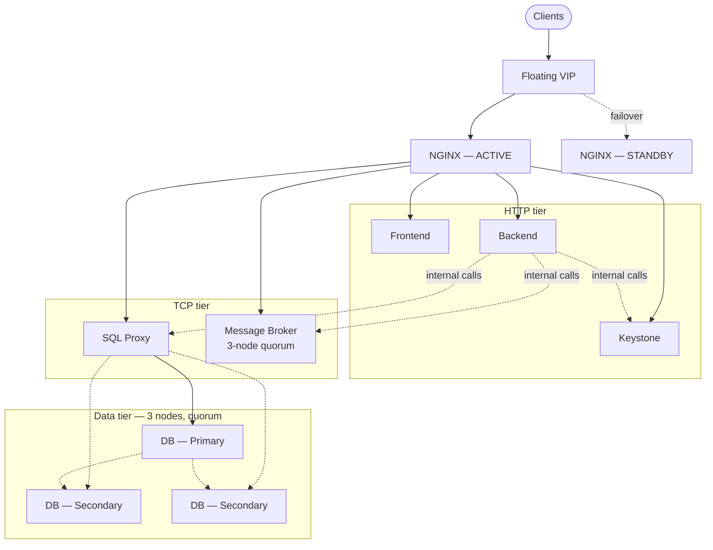

# NGINX High-Availability Load Balancing Architecture — High-Level Design

**Multi-Service Platform — Frontend, Backend, MySQL, Keystone, RabbitMQ**

v1.0 | 10 September 2026 | Paul Scott

---

## 1. Purpose

This High-Level Design (HLD) describes the target architecture for making a
five-tier platform — public frontend, backend API, MySQL, Keystone (identity),
and RabbitMQ — highly available behind a single NGINX load-balancing layer.
It defines *what* the architecture is and *why* it is shaped this way; it
deliberately does not specify exact configuration syntax, file contents, or
command sequences — that belongs in the LLD.

### 1.1 Document Relationships

| Document | Purpose |
|---|---|
| `haFullStack.md` | Working architecture notes — includes the full rationale for each design decision plus illustrative configuration (NGINX, Keepalived, MySQL, ProxySQL, RabbitMQ, ufw, Prometheus). Source material for both this HLD and the future LLD. |
| **This HLD** | Component-level design, data flow, HA strategy, security posture, and non-functional targets, reviewed and agreed before detailed design proceeds. |
| LLD *(next)* | Exact configuration, parameters, and procedures for every component listed here, organised by build domain (load balancer tier, MySQL tier, RabbitMQ tier, Keystone tier, PKI/TLS, monitoring). |
| Phased Implementation Plan *(after LLD)* | Ordered, task-level rollout derived from the LLD, with verification steps per phase. |

### 1.2 Scope

**In scope:**
- Load-balancing topology and redundancy for all five tiers.
- Data-tier HA strategy (MySQL) and messaging HA strategy (RabbitMQ).
- Identity service (Keystone) HA strategy.
- Transport security posture (TLS, internal mTLS boundary).
- Non-functional targets: availability, recovery time, recovery point.
- Technology choices and the rationale for each.

**Out of scope:**
- Application-level business logic in the frontend or backend services.
- Cloud-provider-specific account, billing, or IAM structure.
- Capacity/sizing beyond the illustrative 2-node-per-tier model.
- Exact configuration syntax and step-by-step build procedures (LLD).

---

## 2. Architecture Overview

The platform is fronted by a pair of identical, interchangeable NGINX nodes
sharing a single floating virtual IP (VIP). No node is permanently
responsible for any subset of the service catalogue — either node can serve
the entire platform, which is what makes the pair genuinely highly available
rather than merely redundant.

Two independent traffic classes are handled on the same NGINX pair:
ordinary HTTP/HTTPS traffic to the frontend, backend, and Keystone; and raw
TCP traffic to the data and messaging tiers, which is never treated as HTTP.
Database traffic is additionally never load-balanced directly — it passes
through a topology-aware SQL proxy that understands which database node is
currently writable.

### 2.1 Key Components

| Component | Role | HA Mechanism |
|---|---|---|
| NGINX load balancer | Single entry point; HTTP and TCP traffic distribution | Active/standby pair behind a VRRP-managed VIP |
| Frontend | User-facing web application | Stateless, horizontally scaled behind NGINX |
| Backend | Business-logic API | Stateless, horizontally scaled behind NGINX |
| Keystone | Identity and token service | Active-active, shared DB + shared token cache |
| SQL proxy (ProxySQL) | Read/write-aware routing to the data tier | Deployed in pairs behind the TCP tier |
| MySQL | Persistence | Single-primary synchronous group replication, 3-node quorum |
| RabbitMQ | Asynchronous messaging | Clustered, replicated queue state, 3-node quorum |

---

## 3. Traffic and Data Flow

### 3.1 Client Request Flow (HTTP Tier)

A client request reaches the VIP, is handled by whichever NGINX node is
currently active, and is routed by hostname to the appropriate upstream
service (frontend, backend, or Keystone). Each service is horizontally
scaled and stateless from NGINX's point of view — any healthy instance can
answer any request, so no session affinity is required by default.

### 3.2 Data Write/Read Flow (Database Tier)

Backend requests that need persistence are routed through the SQL proxy
tier, never directly to a database node. The proxy tier distinguishes reads
from writes: writes always go to the current primary; reads may be served by
either database node. If the primary changes — planned or unplanned — the
proxy tier detects the new primary and retargets writes to it automatically,
without any change required on the calling service.

### 3.3 Messaging Flow

Services publish and consume messages via the broker cluster, reached
through the same NGINX TCP tier as the database. Because broker connections
are long-lived, a broker node failure is handled by client-side reconnection
back through the VIP — not by NGINX alone — so client libraries must support
connection recovery.

### 3.4 Identity Flow

Both Keystone instances validate tokens against a shared cache, so a token
issued by one instance is valid when checked by the other. This is what
allows Keystone to run active-active rather than active-passive: there is no
per-instance state a client could get "stuck" behind.

---

## 4. High Availability Design

### 4.1 Load Balancer Redundancy

The NGINX pair is the platform's single point of ingress, so its own
redundancy is the foundation the rest of the design depends on. Failover is
automatic and sub-second-to-few-seconds, driven by a VRRP-managed floating
IP rather than DNS changes or manual intervention — DNS-based failover is
too slow (driven by client-side TTL/caching behaviour outside the platform's
control) to meet the recovery targets in Section 6.

### 4.2 Database Redundancy

The database tier tolerates the loss of any single node without data loss
under normal (non-correlated) failure conditions: replication is synchronous
at the point of commit, and primary election is automatic. This is the one
tier where "just load balance it" is explicitly the wrong design — see
`haFullStack.md` §2.3 for the full reasoning.

This tier requires a **minimum of three nodes**, not two. The consensus
mechanism behind automatic primary election only tolerates a node failure if
a majority of the group remains — with two nodes, losing either one leaves
no majority at all, so the tier would lose write capability entirely rather
than degrade gracefully. This is the same quorum constraint RabbitMQ's
replicated queues are subject to (§4.3); see `haFullStack.md` §2.4 for the
full reasoning and the general "2F+1 nodes tolerate F failures" rule behind
it.

### 4.3 Messaging Redundancy

The broker tier tolerates the loss of any single node without losing
confirmed (acknowledged) messages, via a replicated consensus mechanism
rather than best-effort mirroring.

Like the database tier, this requires a **minimum of three nodes**: the
consensus mechanism behind leader election for each queue only tolerates a
node failure if a majority of the replica set remains, and with two nodes
there is no majority left once either one is lost. The same 2F+1 rule from
§4.2 applies here — three nodes is the minimum that survives losing one.

### 4.4 Identity Redundancy

The identity tier tolerates the loss of either node with no failover delay
at all, because both nodes are already serving traffic simultaneously
(active-active) rather than one standing by.

---

## 5. Security Design

### 5.1 Principles

- **Least exposure**: only the HTTP tier is reachable from outside the
  platform's network boundary. The database and messaging tiers are
  reachable only from the load-balancer nodes.
- **Encrypted in transit, everywhere it crosses a trust boundary**: public
  traffic is TLS-terminated at the load balancer; internal service-to-service
  traffic that crosses tier boundaries uses mutual TLS, so both sides
  authenticate each other, not just the client authenticating the server.
- **Short-lived credentials over long-lived ones**: certificates are
  automatically rotated rather than manually generated with year-long
  validity, shrinking the window in which a leaked credential is useful to
  an attacker.

### 5.2 Network Controls

Network policy enforces the least-exposure principle above: the database and
messaging ports are denied by default and explicitly re-opened only to the
load-balancer nodes' addresses. Nothing else on the network — including
other internal services — can reach those ports directly.

### 5.3 Encryption

A private certificate authority issues certificates to every internal
service. Public-facing traffic terminates TLS at the load balancer;
internal east-west calls that cross a tier boundary (backend → identity,
backend → data proxy, backend → broker) additionally require mutual TLS.

---

## 6. Availability

| Target | Value |
|---|---|
| Platform availability target | 99.9% (excludes correlated/regional failures) |
| Single load-balancer node failure — RTO | Seconds |
| Single database node failure — RTO / RPO | Seconds / zero data loss |
| Single broker node failure — RTO / RPO | Seconds / zero loss for confirmed messages |
| Single identity node failure — RTO | Zero (active-active, no failover needed) |
| Correlated failure (e.g. full availability-zone loss) | Out of scope for this design alone — requires a separate DR strategy |

Full per-component failure-mode detail (detection mechanism, exact recovery
action) is in `haFullStack.md` §10, and will be carried forward into the LLD.

---

## 7. Technology Choices

| Decision | Chosen | Rejected Alternative | Rationale |
|---|---|---|---|
| Load balancer | NGINX (OSS) + Keepalived | NGINX Plus | Avoids licensing cost; active health checks are the only capability given up, and are compensated for by passive checks plus monitoring-driven alerting (§ Availability). |
| VIP failover | VRRP (unicast) | DNS-based failover | Meets second-scale RTO targets; DNS failover is bounded by client-side TTL/caching, which is not reliably sub-second. |
| Database HA | MySQL Group Replication (single-primary), 3 nodes | Multi-primary Group Replication; Galera (2 data nodes + `garbd` witness) | Single-primary avoids application-level write-conflict handling; multi-primary was rejected specifically because it pushes conflict resolution onto every service that writes to the database. Galera's lightweight witness node would have made the 3-way quorum cheaper than a full 3rd MySQL replica, but was rejected based on prior operational experience with Galera's cluster join/leave behaviour causing its own problems — full-cost quorum was judged the safer trade. |
| Database proxy | ProxySQL | MaxScale | Comparable capability; ProxySQL was chosen for broader community familiarity within the team. Either is a defensible choice — this is the one decision in this document with the weakest differentiation and worth revisiting if operational experience favours the alternative. |
| Messaging HA | RabbitMQ quorum queues, 3 nodes | Classic mirrored queues | Quorum queues are RabbitMQ's supported forward path; mirrored queues are deprecated upstream. Three nodes, not two, for the same Raft-quorum reason as the database tier (§4.3) — RabbitMQ has no lightweight witness-node option either. |

---

## 8. Assumptions

- Two-node-per-tier is sufficient for the current load; horizontal scaling
  beyond two nodes per tier is a capacity decision, not an architecture
  change, and is not constrained by anything in this design.
- All tiers run within a single availability domain for the scope of this
  design; cross-region/cross-AZ disaster recovery is a separate initiative.
- Client libraries used by services connecting to RabbitMQ support
  connection recovery (see §3.3) — this is a dependency on application-level
  implementation, not something the platform can enforce centrally.
- A private certificate authority is available or will be stood up as part
  of this initiative (see LLD).

---

## 9. Risks

| Risk | Impact | Mitigation |
|---|---|---|
| VRRP multicast blocked by network policy (common in cloud VPCs) | Silent failure of automatic failover | Use unicast VRRP peering explicitly, not the multicast default — covered in the LLD. |
| Client library lacks AMQP connection-recovery support | Messaging failover is not actually transparent to that client | Confirm connection-recovery support per client library during Phase 3 of the rollout; treat as a blocking finding if absent. |
| Certificate rotation automation not built before go-live | Reverts to manual rotation, reintroducing the expiry/rotation risk this design set out to remove | Sequence PKI automation (LLD Phase 4) before any service takes a hard mTLS dependency. |
| Two-node tiers have no capacity headroom for a rolling upgrade without a brief reduction in redundancy | A planned maintenance window temporarily loses the "tolerate one failure" property | Schedule maintenance windows explicitly; consider a third node per tier if maintenance frequency makes this unacceptable. |

---

## 10. Document History

| Version | Date | Author | Change Summary |
|---|---|---|---|
| v1.0 | 2026-09-10 | Paul Scott | Initial HLD, derived from `haFullStack.md`. |
| v1.1 | 2026-09-10 | Paul Scott | Corrected the database tier to 3 nodes — 2 nodes gives zero fault tolerance under majority-quorum consensus (§4.2), and Galera+witness was considered and rejected in favour of a full 3rd node (§7), based on prior operational experience with Galera. |
| v1.2 | 2026-09-10 | Paul Scott | Same correction applied to the messaging tier — RabbitMQ quorum queues are Raft-based and subject to the identical majority-quorum constraint (§4.3); bumped from 2 to 3 nodes. |
