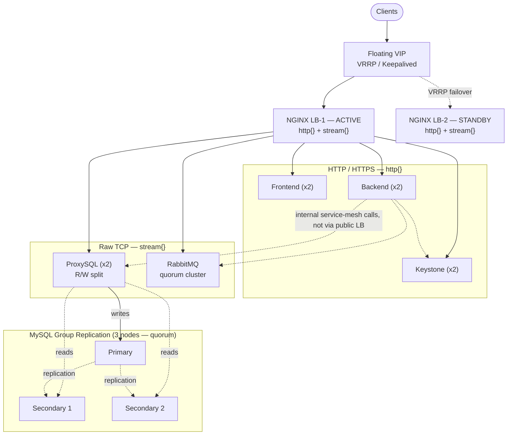

# NGINX High-Availability Load Balancing Architecture

**Multi-Service Platform — Frontend, Backend, MySQL, Keystone, RabbitMQ**

v1.0 | 10 September 2026 | Paul Scott

---

## 1. Purpose and Scope

This document defines a high-availability (HA) architecture for a multi-service
platform comprising a public web tier (frontend, backend), an identity service
(Keystone), a relational data tier (MySQL), and an asynchronous message broker
(RabbitMQ), fronted by NGINX.

> **Design principle —** every load-balancer node in this architecture is
> identical and interchangeable. No node owns a subset of the service
> catalogue. That was the central flaw in the previous draft of this
> document: three non-interchangeable load-balancer nodes each fronted a
> different slice of the stack, so losing any single one of them took its
> entire tier down with it — the opposite of high availability.

### 1.1 In Scope

- NGINX load-balancing topology and configuration (HTTP and raw-TCP traffic classes).
- TLS termination and mutual TLS (mTLS) for internal service-to-service traffic.
- High-availability design for NGINX, MySQL, RabbitMQ, and Keystone.
- Network topology, port mapping, and firewall policy.
- Failure-mode analysis with recovery time / recovery point targets.
- Monitoring, logging, and a phased rollout plan.

### 1.2 Out of Scope

- Application-level session/business logic within the frontend or backend services.
- Cloud-provider-specific IAM, billing, or account structure.
- Capacity sizing beyond the illustrative 2-node examples used throughout.

---

## 2. Architecture Overview

All NGINX nodes are identical, active-standby peers fronted by a single floating
virtual IP (VIP) managed by VRRP (Keepalived). Clients and internal callers only
ever address the VIP — never an individual node — so which physical node is
currently active is an implementation detail, not something a client, DNS
record, or another service needs to know about.

Traffic is split into two classes handled by two different NGINX modules on the
same nodes: ordinary HTTP/HTTPS traffic (frontend, backend, Keystone) is
handled by the `http{}` module; raw TCP traffic (MySQL, RabbitMQ AMQP) is
handled by the separate `stream{}` module. This distinction matters because
the previous draft of this document tried to `proxy_pass` MySQL and RabbitMQ
traffic from inside an `http{}` block, which does not work — those protocols
are not HTTP and NGINX's HTTP proxy directives do not apply to them.

### 2.1 Components

| Component | Instances | Role |
|---|---|---|
| NGINX LB | 2 (active / standby) | VIP owner; HTTP and TCP/stream load balancing |
| Frontend | 2 | Serves the user-facing web application |
| Backend | 2 | Business logic API, stateless |
| Keystone | 2 | Identity service, active-active, shared DB backend |
| ProxySQL | 2 | Read/write-splitting proxy in front of MySQL |
| MySQL (Group Replication) | 3 (1 primary, 2 secondaries) | Persistence, single-primary mode, quorum-tolerant |
| RabbitMQ | 3 (quorum cluster) | Asynchronous message broker, quorum-tolerant |

### 2.2 Topology Diagram



### 2.3 Why Not Load-Balance the Database Directly

MySQL replicas are not interchangeable for writes. Round-robining client
connections across `mysql1`/`mysql2` — as the previous draft's NGINX upstream
block did — sends writes to all nodes. Under Group Replication in
single-primary mode (the recommended, safer mode) only one node accepts writes
at all; a naive TCP load balancer has no way to know which one, so most write
attempts would fail outright. ProxySQL sits between NGINX's `stream{}` block
and the MySQL group specifically to solve this: it understands MySQL's
replication topology, always routes writes to the current primary, and
spreads reads across the secondaries.

### 2.4 Why Three Nodes, Not Two

Group Replication certifies every transaction via majority consensus: a
write only commits once **more than half** the group has agreed to it. With
a 2-node group, "more than half of 2" is 2 — both nodes must be up. Lose
either one and the survivor can no longer reach a majority on its own, so it
stops accepting writes too, and normally drops out of `ONLINE` state
requiring manual intervention to reform the group. **A 2-node Group
Replication cluster tolerates zero node failures** — it doesn't degrade
gracefully, it goes down.

This is standard Paxos/Raft-style quorum math, the same reasoning behind
RabbitMQ's own recommendation to run quorum queues across an odd number of
nodes (Section 6.2): to tolerate **F** node failures you need **2F + 1**
nodes. To survive any single node dying, that's a minimum of three.

Group Replication has no lightweight "witness" node option (unlike Galera's
`garbd`, which votes for quorum without holding data) — every member is a
full MySQL instance with the complete dataset. The third node is therefore a
full-cost database server, not a cheap arbitrator; that trade-off was chosen
deliberately over switching to Galera specifically to keep single-primary
mode's simpler write-conflict story, based on prior operational experience
with Galera's cluster join/leave behaviour causing its own problems.

---

## 3. NGINX Load Balancer Tier

### 3.1 HTTP / HTTPS Load Balancing

Each HTTP service gets its own server block on its own hostname, rather than a
shared vhost split by URL path prefix. Path-prefix routing (as in the previous
draft's `/frontend` and `/backend` locations) silently forwards that same
prefix through to the backend unless it is explicitly rewritten — real
frontend and API applications are not written expecting a stray `/backend`
prefix on every route, so that pattern breaks routing in practice. Separate
hostnames avoid the problem entirely.

```nginx
# /etc/nginx/nginx.conf  (http context)
http {
    upstream frontend {
        server frontend1:80  max_fails=3 fail_timeout=10s;
        server frontend2:80  max_fails=3 fail_timeout=10s;
    }
    upstream backend {
        server backend1:8080 max_fails=3 fail_timeout=10s;
        server backend2:8080 max_fails=3 fail_timeout=10s;
    }
    upstream keystone {
        server keystone1:5000 max_fails=3 fail_timeout=10s;
        server keystone2:5000 max_fails=3 fail_timeout=10s;
    }

    server {
        listen 80;
        server_name app.example.com;
        location / {
            proxy_pass http://frontend;
            proxy_set_header Host $host;
            proxy_set_header X-Real-IP $remote_addr;
        }
    }

    server {
        listen 80;
        server_name api.example.com;
        location / {
            proxy_pass http://backend;
            proxy_set_header Host $host;
            proxy_set_header X-Real-IP $remote_addr;
        }
    }
}
```

### 3.2 TCP / Stream Load Balancing (MySQL, RabbitMQ)

The `stream{}` module is a top-level context, a sibling of `http{}` — not
something nested inside it. It is what actually makes raw-TCP load balancing
possible.

```nginx
# /etc/nginx/nginx.conf  (top level, sibling of http{})
stream {
    upstream proxysql_write {
        server proxysql1:6033 max_fails=3 fail_timeout=10s;
        server proxysql2:6033 max_fails=3 fail_timeout=10s;
    }
    upstream rabbitmq_amqp {
        server rabbitmq1:5672 max_fails=3 fail_timeout=10s;
        server rabbitmq2:5672 max_fails=3 fail_timeout=10s;
        server rabbitmq3:5672 max_fails=3 fail_timeout=10s;
    }

    server {
        listen 3306;
        proxy_pass proxysql_write;
        proxy_timeout 3s;
        proxy_connect_timeout 2s;
    }
    server {
        listen 5672;
        proxy_pass rabbitmq_amqp;
        proxy_timeout 3s;
    }
}
```

### 3.3 Health Checks

Stock open-source NGINX does not ship active health checks — that capability
is either an NGINX Plus feature or requires a third-party patch module
(`nginx_upstream_check_module`). It is not something a default apt/yum install
of NGINX provides, and the previous draft did not make that distinction. What
OSS NGINX does provide, built in, is passive health checking: a backend is
taken out of rotation after a number of failed proxy attempts, and retried
after a cool-down period.

```nginx
upstream backend {
    server backend1:8080 max_fails=3 fail_timeout=10s;
    server backend2:8080 max_fails=3 fail_timeout=10s;
}
```

> **If active health checks are required —** either budget for NGINX Plus, or
> put a lightweight external health-check orchestrator (e.g. Consul, or a
> small sidecar) in the loop that rewrites the upstream block / reloads NGINX
> on failure. Don't assume `nginx_upstream_check_module` is available without
> explicitly building it in.

### 3.4 Session Persistence

`ip_hash` pins a client to a backend by source IP, not by application session.
Behind shared NAT or corporate egress, many distinct users share one IP and
get concentrated onto a single backend node — an uneven load distribution
that gets worse, not better, under load. The more robust fix is to make the
backend tier genuinely stateless and externalise session state to a shared
store (e.g. Redis), so any backend node can serve any request and `ip_hash`
is unnecessary.

```nginx
# Only if statelessness genuinely cannot be achieved short-term:
upstream backend {
    ip_hash;
    server backend1:8080;
    server backend2:8080;
}
```

### 3.5 NGINX Node Redundancy — Keepalived

VRRP's default multicast advertisement is frequently blocked by cloud VPC
networking (AWS, GCP, Azure all restrict or drop multicast/broadcast by
default). The previous draft's Keepalived config only showed a MASTER block
and used the multicast default — in most cloud environments that
configuration silently never fails over. Unicast peering avoids the
dependency on multicast entirely.

```conf
# /etc/keepalived/keepalived.conf  — MASTER node (nginx-lb-1)
vrrp_instance VI_1 {
    interface eth0
    state MASTER
    virtual_router_id 51
    priority 150
    advert_int 1
    nopreempt
    unicast_src_ip 10.0.1.11
    unicast_peer {
        10.0.1.12
    }
    authentication {
        auth_type PASS
        auth_pass <shared-secret>
    }
    virtual_ipaddress {
        10.0.1.100/24
    }
}
```

```conf
# /etc/keepalived/keepalived.conf  — BACKUP node (nginx-lb-2)
vrrp_instance VI_1 {
    interface eth0
    state BACKUP
    virtual_router_id 51
    priority 100
    advert_int 1
    nopreempt
    unicast_src_ip 10.0.1.12
    unicast_peer {
        10.0.1.11
    }
    authentication {
        auth_type PASS
        auth_pass <shared-secret>
    }
    virtual_ipaddress {
        10.0.1.100/24
    }
}
```

`nopreempt` prevents the original MASTER from immediately reclaiming the VIP
the moment it recovers — without it, a node that is flapping (briefly
unhealthy, recovering, failing again) can cause the VIP to bounce back and
forth ("flapping"), each transition costing a few seconds of connection
resets.

---

## 4. TLS and Mutual TLS

### 4.1 Certificate Authority and Lifecycle

Use a private CA (step-ca or an internal OpenSSL-based root/intermediate
pair) rather than one-off self-signed certificates per host. A private CA
gives every service a certificate chain that every other service can verify
against a single trusted root, and — critically — enables automated
short-lived certificate issuance and rotation instead of manual, easily-
forgotten renewal.

> **Rotation —** target a maximum certificate lifetime of 90 days for
> internal service certificates, issued and renewed automatically (step-ca's
> ACME support, or a scheduled job calling the CA API). Manually generated
> 365-day certs, as in the previous draft, have no forcing function to ever
> get rotated or revoked.

### 4.2 NGINX SSL Termination

```nginx
# /etc/nginx/conf.d/ssl.conf
server {
    listen 443 ssl;
    server_name app.example.com;

    ssl_certificate     /etc/nginx/ssl/app.crt;
    ssl_certificate_key /etc/nginx/ssl/app.key;
    ssl_protocols       TLSv1.2 TLSv1.3;
    ssl_ciphers         HIGH:!aNULL:!MD5;
    ssl_prefer_server_ciphers on;

    location / {
        proxy_pass http://frontend;
        proxy_set_header Host $host;
        proxy_set_header X-Real-IP $remote_addr;
        proxy_set_header X-Forwarded-Proto https;
    }
}
```

### 4.3 Mutual TLS for Internal (East-West) Traffic

Backend-to-Keystone, backend-to-ProxySQL, and backend-to-RabbitMQ calls all
cross a trust boundary and should present client certificates issued by the
same internal CA. Example for MySQL / ProxySQL:

```ini
[mysqld]
require_secure_transport = ON
ssl-ca   = /etc/mysql/ssl/ca.crt
ssl-cert = /etc/mysql/ssl/server-cert.pem
ssl-key  = /etc/mysql/ssl/server-key.pem
```

---

## 5. MySQL High Availability

> **Do not put a database directly behind a generic load balancer.** A load
> balancer has no concept of which node can currently accept writes; only a
> topology-aware proxy (ProxySQL, MaxScale) or a VIP explicitly pinned to the
> current primary should sit in front of a replicated database.

### 5.1 Group Replication — Single-Primary Mode

Single-primary mode is recommended over multi-primary: only one node accepts
writes at a time, which sidesteps the write-conflict resolution complexity
that multi-primary mode requires the application to be aware of. Three nodes
are the minimum for this mode to actually tolerate a failure — see §2.4 for
why two is not enough.

```ini
[mysqld]
# Shown for node 1 (mysql1, 10.0.2.11) — nodes 2 and 3 are identical except
# for server-id and group_replication_local_address.
server-id = 1
gtid_mode = ON
enforce_gtid_consistency = ON
binlog_format = ROW
log_bin = mysql-bin
log_slave_updates = ON

group_replication_group_name = "aaaaaaaa-bbbb-cccc-dddd-eeeeeeeeeeee"
group_replication_start_on_boot = OFF
group_replication_local_address = "10.0.2.11:33061"
group_replication_group_seeds = "10.0.2.11:33061,10.0.2.12:33061,10.0.2.13:33061"
group_replication_single_primary_mode = ON
group_replication_enforce_update_everywhere_checks = OFF
```

```sql
-- Bootstrap the first node only:
SET GLOBAL group_replication_bootstrap_group = ON;
START GROUP_REPLICATION;
SET GLOBAL group_replication_bootstrap_group = OFF;

-- Every subsequent node (mysql2, then mysql3):
START GROUP_REPLICATION;
```

### 5.2 ProxySQL — Read/Write Splitting

ProxySQL is configured with a read/write hostgroup pair. Its own monitor
process polls each MySQL node's replication state and automatically re-tags
whichever node is the current primary as the write hostgroup target —
including immediately after a failover.

```sql
INSERT INTO mysql_servers (hostgroup_id, hostname, port) VALUES
  (10, 'mysql1', 3306),   -- write hostgroup (primary)
  (20, 'mysql1', 3306),   -- read hostgroup (primary)
  (20, 'mysql2', 3306),   -- read hostgroup (secondary 1)
  (20, 'mysql3', 3306);   -- read hostgroup (secondary 2)

INSERT INTO mysql_query_rules (rule_id, match_pattern, destination_hostgroup, apply)
VALUES (1, '^SELECT.*', 20, 1);   -- reads -> hostgroup 20
-- everything else (INSERT/UPDATE/DELETE) falls through to the default write hostgroup 10

LOAD MYSQL SERVERS TO RUNTIME;
LOAD MYSQL QUERY RULES TO RUNTIME;
```

### 5.3 Failover Behaviour

| Event | Detection | Recovery Action | RTO | RPO |
|---|---|---|---|---|
| Primary node fails | Group Replication member state change; ProxySQL monitor next poll | Remaining 2 of 3 nodes still hold majority; Group Replication auto-elects a new primary; ProxySQL retags write hostgroup | ~5-10 s | 0 (synchronous cert-based certification) |
| One secondary fails | Group Replication member state change | Removed from read hostgroup automatically; primary unaffected — 2 of 3 nodes is still a majority | 0 (reads redistribute across the remaining secondary) | 0 |
| **Two nodes fail simultaneously** | Group Replication member state change | **Below quorum — the surviving node cannot certify writes and drops out of `ONLINE` state.** Requires manual intervention (`group_replication_force_members`) to reform the group on the survivor. | Manual, minutes | 0 (no data loss, but a real outage until reformed) |
| ProxySQL node fails | NGINX `stream{}` passive health check | NGINX removes it from the stream upstream | ~10 s (fail_timeout) | 0 |

---

## 6. RabbitMQ High Availability

### 6.1 Cluster Formation

```bash
# On rabbitmq2 and rabbitmq3, joining rabbitmq1:
rabbitmqctl stop_app
rabbitmqctl join_cluster rabbit@rabbitmq1
rabbitmqctl start_app
```

### 6.2 Why Three Nodes, Not Two

Quorum queues are Raft-based and subject to exactly the same majority-quorum
constraint as MySQL Group Replication (§2.4): a queue's replicas only elect a
leader and accept new operations if **more than half** the replica set is
reachable. With 2 replicas, "more than half of 2" is 2 — both nodes must be
up, so a 2-node quorum queue tolerates zero node failures, the same
zero-fault-tolerance trap the database tier was in. RabbitMQ's own
documentation recommends an odd node count for this exact reason. Three
nodes is the minimum that actually survives losing one.

### 6.3 Quorum Queues — Primary Recommendation

Quorum queues (Raft-based) have been RabbitMQ's recommended HA queue type
since 3.8, and classic mirrored queues are formally deprecated as of 3.12+
with removal planned in a future release. Any new design should default to
quorum queues, not mirrored queues — the previous draft had this backwards,
leading with mirrored queues and mentioning quorum queues only as an aside.

```bash
rabbitmqctl set_policy quorum-default "^" \
  '{"queue-type":"quorum","x-quorum-initial-group-size":3}' \
  --apply-to queues
```

### 6.4 Classic Mirrored Queues (Legacy)

Only relevant if migrating an existing deployment that still uses them, or
integrating with a client library that does not yet support quorum queues:

```bash
rabbitmqctl set_policy ha-all "^(?!amq\.).*" '{"ha-mode":"all"}'
```

### 6.5 Client Reconnection Behaviour

AMQP clients hold long-lived, stateful connections through NGINX's `stream{}`
proxy to the VIP. On a RabbitMQ node failure, the client's existing TCP
connection drops; a correctly configured client library (e.g. the official
Pika/amqplib clients with connection-recovery enabled) reconnects to the same
`VIP:5672` address, which NGINX then routes to a surviving cluster member.
Quorum queues guarantee no message loss for confirmed publishes across this
reconnection.

---

## 7. Keystone High Availability

Keystone is stateless once its database and token cache are externalised,
which makes active-active the natural deployment mode.

- Deploy Keystone in active-active mode; both instances share the MySQL
  backend described in Section 5.
- Use memcached (itself deployed as a 2-node pool) for Fernet token caching —
  this is what allows either Keystone instance to validate a token issued by
  the other.
- NGINX load-balances the Keystone API over HTTP (Section 3.1) — no session
  affinity required, since token validation state lives in memcached, not
  in-process.

---

## 8. Network Topology and Port Mapping

| Service | Port | Protocol | NGINX Context | Notes |
|---|---|---|---|---|
| Frontend | 80 / 443 | HTTP/HTTPS | `http{}` | `app.example.com` vhost |
| Backend | 80 / 443 | HTTP/HTTPS | `http{}` | `api.example.com` vhost |
| Keystone | 5000 | HTTP | `http{}` | `identity.example.com` vhost |
| MySQL (via ProxySQL) | 3306 | MySQL wire protocol | `stream{}` | Never expose mysqld's own 3306 externally |
| RabbitMQ AMQP | 5672 | AMQP | `stream{}` | Long-lived connections |
| RabbitMQ Management UI | 15672 | HTTP | `http{}`, internal-only | Restrict to admin network |

---

## 9. Firewall Rules

Rule order matters with `ufw`: a later bare deny with no source qualifier
applies to everyone, including the load balancer whose traffic an earlier
rule just allowed. The previous draft's example did exactly that
(allow-then-deny on the same port with no source on the deny), which would
have locked out the load balancer itself. The fix is to deny first with the
broadest rule, then allow the specific, narrower exception — `ufw` evaluates
rules in order and the first match wins.

```bash
# Default-deny the database/broker ports, then explicitly allow only the LB nodes.
sudo ufw deny 3306
sudo ufw deny 5672
sudo ufw allow from 10.0.1.11 to any port 3306,5672 proto tcp
sudo ufw allow from 10.0.1.12 to any port 3306,5672 proto tcp

# Public-facing ports, open to all:
sudo ufw allow 80/tcp
sudo ufw allow 443/tcp
```

---

## 10. Failure Mode Analysis

This section replaces a simple list of HA product names with an explicit
walkthrough of what actually happens when each component fails, and the
recovery time (RTO) / recovery point (RPO) implied by the design above.

| Component | Failure | Detection | Recovery | RTO | RPO |
|---|---|---|---|---|---|
| Active NGINX node | Process crash / host failure | Keepalived VRRP advert timeout (~3x advert_int) | VIP migrates to standby node | ~3 s | 0 |
| MySQL primary (1 of 3 nodes) | Process crash / host failure | Group Replication member-state change | 2 of 3 nodes retain majority; new primary auto-elected; ProxySQL retags write hostgroup | ~5-10 s | 0 |
| RabbitMQ node (1 of 3) | Process crash / host failure | Cluster membership change; client TCP reset | 2 of 3 replicas retain majority; quorum re-elects leader per queue; client reconnects via VIP | ~seconds (client-dependent) | 0 for confirmed publishes |
| **RabbitMQ — 2 nodes fail simultaneously** | Cluster membership change | **Below quorum — affected queues have no leader and stop accepting operations.** Requires manual intervention (`rabbitmqctl force_boot` on a surviving node) to restore service. | Manual, minutes | 0 for prior confirmed publishes; new publishes blocked until restored |
| Keystone node | Process crash / host failure | NGINX passive health check | Traffic drains to surviving node; both share DB + memcached | ~10 s (fail_timeout) | 0 (stateless) |
| Entire LB tier (both nodes) | Correlated failure (e.g. AZ outage) | External monitoring / synthetic checks | Manual: promote a DR-region pair, or restore from IaC — see §12 | Minutes (out of scope for VRRP alone) | 0 for data tiers; depends on DR region lag |

---

## 11. Monitoring and Logging

### 11.1 Monitoring Stack

- **Prometheus** — scrapes NGINX (nginx-prometheus-exporter), MySQL
  (mysqld_exporter), RabbitMQ (built-in prometheus plugin), and node-level
  metrics.
- **Grafana** — dashboards for request rate, error rate, latency,
  replication lag, queue depth.
- **Alertmanager** — pages on: VIP failover event, Group Replication member
  count < 3 (warning — running with no remaining failure headroom) and < 2
  (critical — quorum lost, writes unavailable), quorum queue leaderless,
  certificate expiry < 14 days.

```yaml
# /etc/prometheus/prometheus.yml
scrape_configs:
  - job_name: 'nginx'
    static_configs:
      - targets: ['nginx-lb-1:9113', 'nginx-lb-2:9113']
  - job_name: 'mysql'
    static_configs:
      - targets: ['mysql1:9104', 'mysql2:9104', 'mysql3:9104']
  - job_name: 'rabbitmq'
    static_configs:
      - targets: ['rabbitmq1:15692', 'rabbitmq2:15692', 'rabbitmq3:15692']
```

### 11.2 Logging

Centralise NGINX, MySQL, RabbitMQ, and Keystone logs (ELK/OpenSearch, or a
managed equivalent). At minimum, capture NGINX access and error logs:

```nginx
access_log /var/log/nginx/access.log;
error_log  /var/log/nginx/error.log warn;
```

---

## 12. Deployment and Rollout Plan

Infrastructure should be provisioned through your existing IaC toolchain
(Terraform/OpenTofu + Ansible) rather than hand-run commands — the code
blocks in this document are illustrative of the configuration each tool
needs to produce, not drop-in modules. Roll out in the phases below; each
phase is independently verifiable before moving to the next.

### Phase 1 — Load Balancer Foundation

| ID | Task | Description | Status |
|---|---|---|---|
| P1-01 | Provision LB nodes | Two identical hosts for nginx-lb-1/2 | Pending |
| P1-02 | Keepalived unicast VRRP | Configure MASTER/BACKUP with unicast_peer, verify failover | Pending |
| P1-03 | NGINX http{} tier | Frontend/backend/Keystone upstreams and vhosts | Pending |
| P1-04 | NGINX stream{} tier | ProxySQL and RabbitMQ TCP proxying | Pending |

### Phase 2 — MySQL High Availability

| ID | Task | Description | Status |
|---|---|---|---|
| P2-01 | Group Replication bootstrap | Single-primary mode, 3 nodes (quorum-tolerant) | Pending |
| P2-02 | ProxySQL deployment | Read/write hostgroups (3 nodes), monitor user | Pending |
| P2-03 | Failover test | Kill primary, verify auto-promotion + ProxySQL retag | Pending |
| P2-04 | Quorum boundary test | Kill any 2 of 3 nodes, confirm the survivor correctly drops out of `ONLINE` rather than silently serving writes | Pending |

### Phase 3 — RabbitMQ High Availability

| ID | Task | Description | Status |
|---|---|---|---|
| P3-01 | Cluster formation | Join rabbitmq2 and rabbitmq3 to rabbitmq1 (3 nodes, quorum-tolerant) | Pending |
| P3-02 | Quorum queue policy | Apply default quorum policy (initial-group-size 3) to all queues | Pending |
| P3-03 | Client reconnection test | Kill a node mid-publish, verify client recovery + no message loss | Pending |
| P3-04 | Quorum boundary test | Kill any 2 of 3 nodes, confirm affected queues correctly stop accepting operations rather than silently losing messages | Pending |

### Phase 4 — Keystone, TLS, and mTLS

| ID | Task | Description | Status |
|---|---|---|---|
| P4-01 | Private CA | Stand up step-ca or internal OpenSSL CA | Pending |
| P4-02 | NGINX TLS termination | Public-facing 443 vhosts | Pending |
| P4-03 | mTLS internal services | Backend <-> Keystone/ProxySQL/RabbitMQ | Pending |
| P4-04 | Keystone active-active | Shared DB + memcached token cache | Pending |

### Phase 5 — Monitoring and Validation

| ID | Task | Description | Status |
|---|---|---|---|
| P5-01 | Prometheus + exporters | NGINX, MySQL, RabbitMQ exporters live | Pending |
| P5-02 | Alertmanager rules | VIP failover, replication health, queue leaderless, cert expiry | Pending |
| P5-03 | Chaos/failover exercise | Execute every row of the §10 failure-mode table against staging | Pending |

---

## 13. Troubleshooting Guide

### 13.1 Common Issues

| Issue | Possible Cause | Solution |
|---|---|---|
| NGINX fails to start | Syntax error in config | `nginx -t` to validate before reload |
| VIP not failing over | VRRP multicast blocked, or missing `unicast_peer` | Confirm `unicast_src_ip`/`unicast_peer` set on both nodes |
| Writes failing intermittently | Client bypassing ProxySQL, hitting MySQL directly | Confirm 3306 is firewalled to LB nodes only (§9) |
| Quorum queue has no leader | Fewer than (N/2)+1 RabbitMQ nodes reachable | `rabbitmqctl cluster_status`; restore quorum |
| mTLS handshake failure | Client cert not signed by the trusted internal CA, or expired | Verify chain with `openssl verify -CAfile ca.crt client.crt` |

### 13.2 Debugging Commands

```bash
nginx -t                                   # validate NGINX config
tail -f /var/log/nginx/error.log           # NGINX errors
```

```sql
SHOW REPLICA STATUS\G                       -- replication state (MySQL 8.0.22+)
SELECT * FROM performance_schema.replication_group_members;
```

```bash
rabbitmqctl cluster_status                 # RabbitMQ cluster health
rabbitmqctl list_queues name type leader   # confirm quorum queue leaders

systemctl status keepalived                # VRRP state
journalctl -u keepalived -f
```

---

## 14. Appendix

### 14.1 Glossary

| Term | Definition |
|---|---|
| HA | High Availability |
| VIP | Virtual IP — a floating address that moves between nodes on failover |
| VRRP | Virtual Router Redundancy Protocol — the failover mechanism Keepalived implements |
| mTLS | Mutual Transport Layer Security — both peers present certificates |
| RTO | Recovery Time Objective — target time to restore service after a failure |
| RPO | Recovery Point Objective — target maximum data loss, measured in time |
| AMQP | Advanced Message Queuing Protocol |
| Quorum queue | RabbitMQ's Raft-based replicated queue type; the modern HA default |

### 14.2 References

- NGINX stream module documentation — nginx.org/en/docs/stream/ngx_stream_core_module.html
- MySQL Group Replication — dev.mysql.com/doc/refman/8.0/en/group-replication.html
- ProxySQL documentation — proxysql.com/documentation
- RabbitMQ Quorum Queues — rabbitmq.com/quorum-queues.html
- Keepalived unicast configuration — keepalived.readthedocs.io

### 14.3 Document History

| Version | Date | Author | Change Summary |
|---|---|---|---|
| v1.0 | 2026-09-10 | Paul Scott | Full rewrite replacing the original NGINX/HA draft — corrected LB topology (identical/interchangeable nodes, not one node per tier), separated `http{}` vs `stream{}` traffic classes, replaced naive MySQL round-robin with ProxySQL, made quorum queues the primary RabbitMQ recommendation, fixed the Keepalived and ufw examples, and added an explicit failure-mode/RTO/RPO analysis. |
| v1.1 | 2026-09-10 | Paul Scott | Corrected MySQL from 2 to 3 Group Replication nodes — a 2-node group has zero fault tolerance under majority-quorum consensus (losing either node drops the survivor below quorum and it stops accepting writes too). Added §2.4 explaining the quorum math, updated the diagram, config, ProxySQL hostgroups, failover table, and rollout plan accordingly. |
| v1.2 | 2026-09-10 | Paul Scott | Same fix applied to RabbitMQ — quorum queues are Raft-based and subject to the identical majority-quorum constraint (§6.2); bumped from 2 to 3 nodes, updated cluster formation, quorum policy group size, the stream{} upstream, failure-mode table, monitoring targets, and rollout plan accordingly. |
